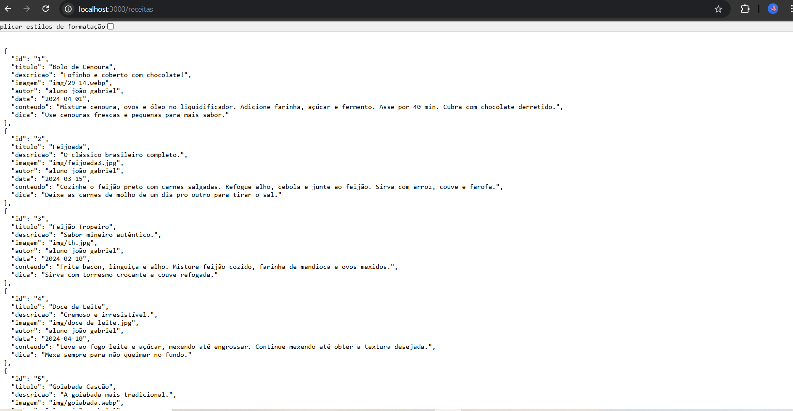
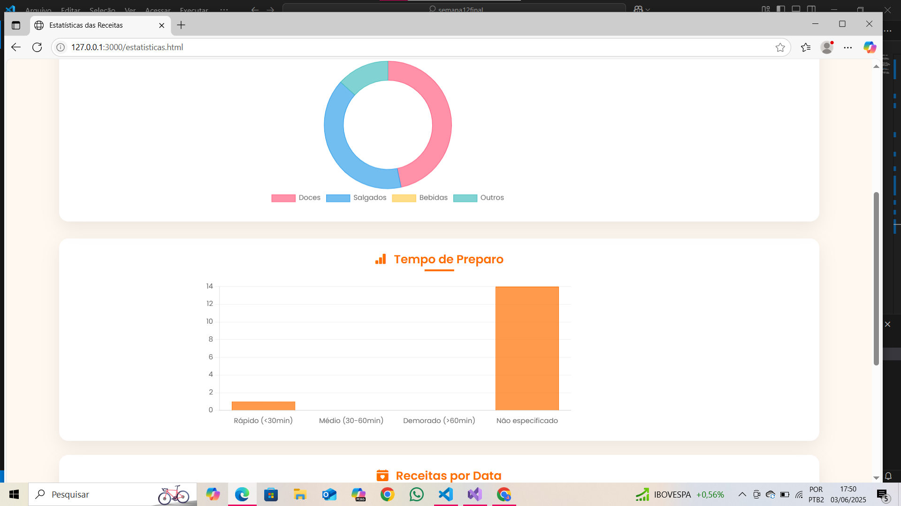

# Trabalho Prático - Semana 14

A partir dos dados cadastrados na etapa anterior, vamos trabalhar formas de apresentação que representem de forma clara e interativa as informações do seu projeto. Você poderá usar gráficos (barra, linha, pizza), mapas, calendários ou outras formas de visualização. Seu desafio é entregar uma página Web que organize, processe e exiba os dados de forma compreensível e esteticamente agradável.

Com base nos tipos de projetos escohidos, você deve propor **visualizações que estimulem a interpretação, agrupamento e exibição criativa dos dados**, trabalhando tanto a lógica quanto o design da aplicação.

Sugerimos o uso das seguintes ferramentas acessíveis: [FullCalendar](https://fullcalendar.io/), [Chart.js](https://www.chartjs.org/), [Mapbox](https://docs.mapbox.com/api/), para citar algumas.

## Informações do trabalho

- Nome:João gabriel Tavares Pinheiro
- Matricula:896487
- Proposta de projeto escolhida:receitas
- Breve descrição sobre seu projeto:site de receitas bonito e funcional

**Print da tela com a implementação**

<< Coloque aqui uma breve explicação da implementação feita nessa etapa>>
Nesta etapa, foi implementada uma visualização dinâmica dos dados utilizando a biblioteca Chart.js. A partir das informações cadastradas via JSON Server, foram processados os dados com JavaScript para gerar dois tipos de gráficos interativos:

Gráfico de Pizza: Mostra a distribuição dos filmes por gênero, permitindo visualizar quais tipos de filmes são mais frequentes.

Gráfico de Barras: Apresenta a média de avaliação dos filmes por gênero, facilitando a comparação da qualidade média percebida entre os diferentes estilos.

A manipulação dos dados foi feita por meio de requisições fetch() à API REST, transformando os dados recebidos em estruturas que pudessem ser lidas pelo Chart.js. A página atualiza dinamicamente os gráficos de acordo com os dados presentes no JSON, refletindo as operações de CRUD feitas na aplicação.
<<  COLOQUE A IMAGEM TELA 1 AQUI >>

<<  COLOQUE A IMAGEM TELA 2 AQUI >>
